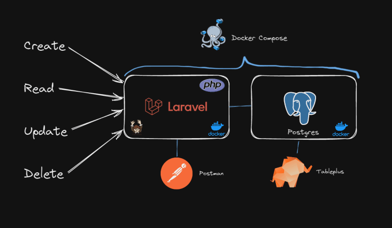

# Rest API Laravel - Postgres - Docker



## 💻 Pré-requisitos

Antes de começar, verifique se você atendeu aos seguintes requisitos:

- Você instalou a versão `<Docker version 26+>`

## 🚀 Instalando <Rest laravel>

Para instalar o <Rest laravel>, siga estas etapas:

Linux :

- Certificar-se que está em root.

1 - docker-compose build
2 - docker-compose up

## ☕ Usando Rest laravel

Para usar Rest laravel, siga estas etapas:

```
<exemplo_de_uso>
```

Adicione comandos de execução e exemplos que você acha que os usuários acharão úteis. Fornece uma referência de opções para pontos de bônus!

## 🤝 Colaboradores

<table>
  <tr>
    <td align="center">
      <a href="https://www.linkedin.com/in/jo%C3%A3o-vitor-de-lima-74441b1b1/" title="Linkedin">
        <br>
        <sub>
          <b>João lima</b>
        </sub>
      </a>
    </td>
  </tr>
</table>
